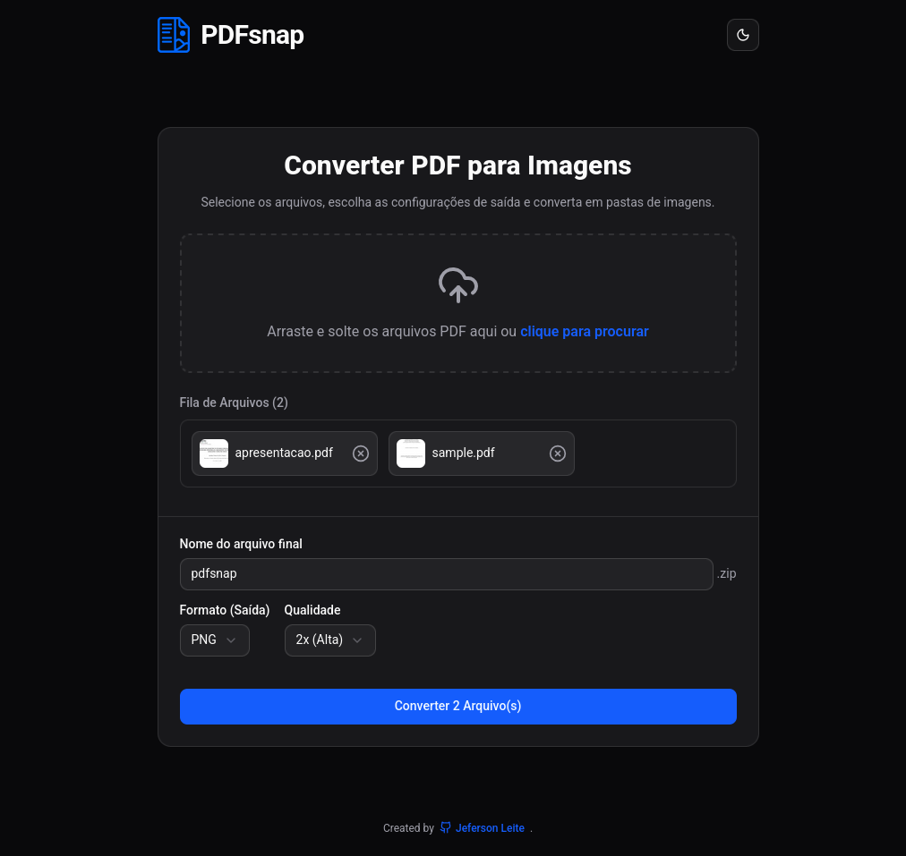

  
  <h1>PDFsnap</h1>
  
PDFsnap é uma aplicação web dedicada a converter arquivos PDF em imagens de alta qualidade.

  

## 🚀 Funcionalidades Principais

- **Conversão de PDF para Imagens**: Selecione arquivos PDF e converta suas páginas em imagens nos formatos PNG ou JPG.
- **Configurações de Qualidade**: Escolha entre diferentes níveis de qualidade para as imagens geradas (2x, 4x, 8x).
- **Compactação em ZIP**: Após a conversão, todas as imagens são compactadas em um arquivo ZIP para facilitar o download.
- **Fila de Arquivos**: Adicione múltiplos arquivos PDF à fila e processe todos de uma vez.
- **Geração de Miniaturas**: Visualize miniaturas das páginas dos PDFs antes de iniciar a conversão.
- **Interface Drag-and-Drop**: Arraste e solte arquivos diretamente na área de upload.
- **Tema Escuro/Claro**: Alterne entre temas para uma experiência personalizada.

## ⚙️ Como Usar

1. **Adicione Arquivos**: Arraste e solte seus arquivos PDF na área de upload ou clique para selecionar os arquivos manualmente.
2. **Configure as Opções**:
   - Nome do arquivo ZIP final.
   - Formato das imagens (PNG ou JPG).
   - Qualidade das imagens (2x, 4x, 8x).
3. **Inicie a Conversão**: Clique no botão "Converter" para processar os arquivos.
4. **Baixe o Resultado**: Após a conversão, o arquivo ZIP estará disponível para download.

## 🛠️ Tecnologias Utilizadas

- **React**: Biblioteca JavaScript para construção da interface do usuário.
- **TypeScript**: Superset do JavaScript para tipagem estática.
- **Vite**: Ferramenta de build rápida para desenvolvimento web moderno.
- **PDF.js**: Biblioteca para manipulação de arquivos PDF.
- **JSZip**: Biblioteca para criação de arquivos ZIP.
- **Sonner**: Biblioteca para notificações elegantes.

---

## 📄 Licença

Este projeto é distribuído sob a licença MIT.
